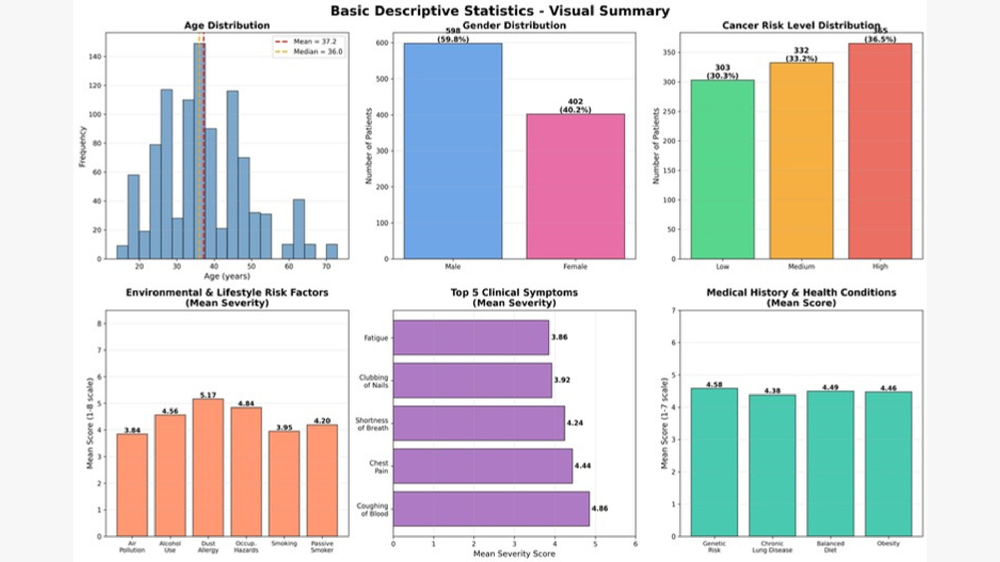
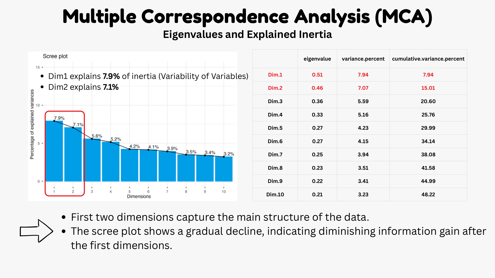
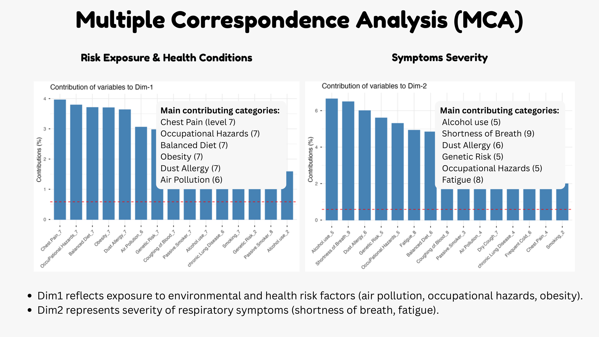
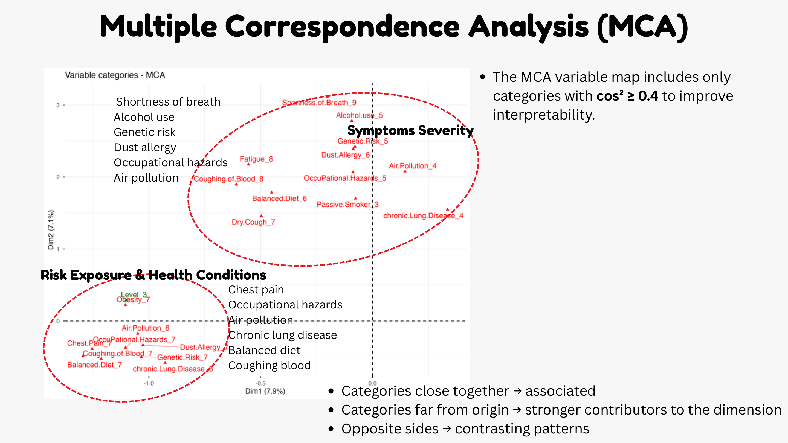
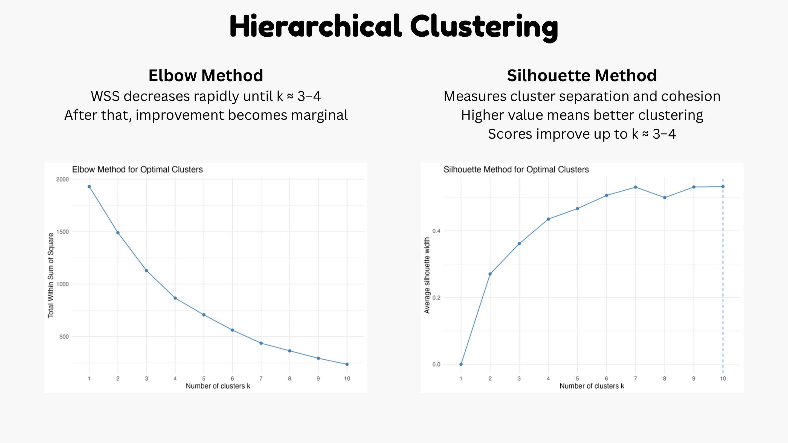
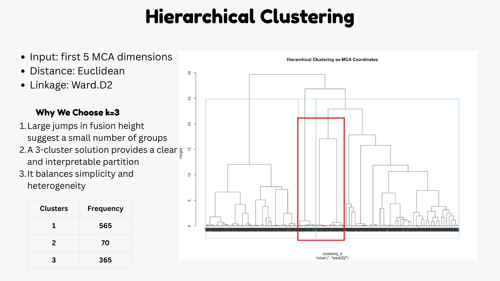
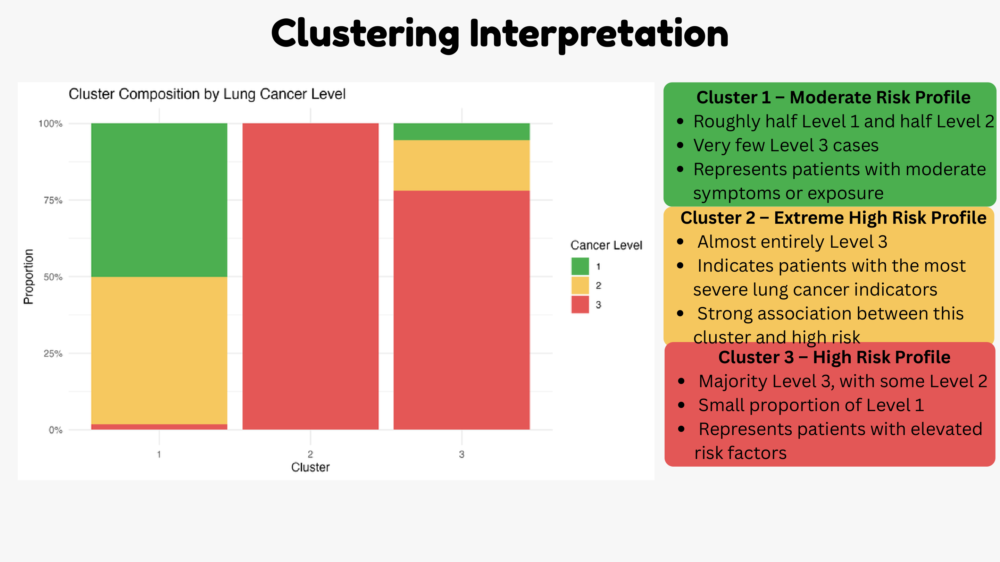
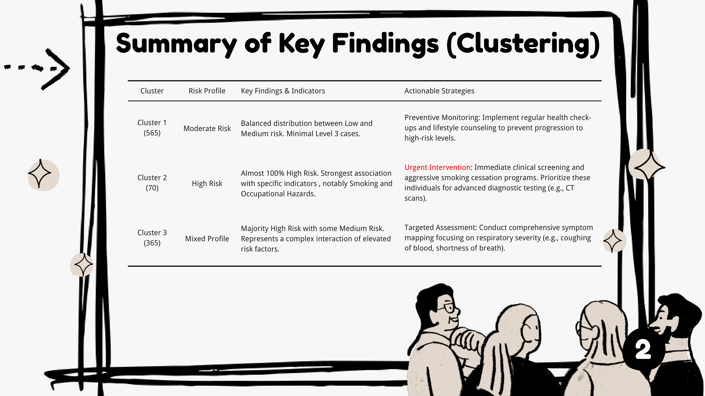

# Lung Cancer Prediction by Using Data Mining Techniques

This folder contains the final project for the **Data Mining for Business** course in the NEOMA MSc Business Analytics program.

The project applies **Multiple Correspondence Analysis (MCA)** and **Hierarchical Clustering** to identify patient profiles associated with lung cancer risk factors, symptoms, and risk levels.

## Project files

| Folder | File | Description |
|---|---|---|
| `scripts/` | `FinalProject_Wenting XU-Chen HE-Tingyi KAO-Hein Htet SOE THAN.R` | R script for data understanding, preprocessing, MCA, hierarchical clustering, cluster visualization, and cluster profile exports. |
| `reports/` | `FinalProject_Wenting XU-Chen HE-Tingyi KAO-Hein Htet SOE THAN.pdf` | Final presentation slides. |
| `figures/` | `*.png` | Key visual outputs arranged according to the plot numbering used in the R code. |

## Research objective

The objective of this project is to identify patient profiles associated with lung cancer risk factors using **Multiple Correspondence Analysis** and **Clustering** techniques.

The analysis focuses on three questions:

1. Are certain risk factors, such as smoking and air pollution, associated with specific lung cancer symptoms?
2. Can patients be grouped into similar profiles based on exposure to risk factors and reported symptoms?
3. What patterns help explain the interaction between lifestyle, environment, health conditions, and lung cancer indicators?

## Dataset overview

The dataset used in this project is the **Cancer Patient Risk Assessment** dataset. Each row represents one patient record.

| Item | Description |
|---|---|
| Sample size | 1,000 patients |
| Predictor variables | 24 variables |
| Outcome variable | Lung cancer risk level: Low, Medium, High |
| Data type | Cross-sectional observational data |
| Scale type | Mostly ordinal categorical variables |
| Missing values | None reported in the presentation |

### Outcome distribution

| Risk level | Count | Percentage |
|---|---:|---:|
| Low | 303 | 30.3% |
| Medium | 332 | 33.2% |
| High | 365 | 36.5% |

### Variable categories

| Category | Variables |
|---|---|
| Demographics | Age, Gender |
| Environmental and lifestyle factors | Air Pollution, Alcohol Use, Dust Allergy, Occupational Hazards, Smoking, Passive Smoker |
| Medical history and health conditions | Genetic Risk, Chronic Lung Disease, Balanced Diet, Obesity |
| Clinical symptoms | Chest Pain, Coughing of Blood, Fatigue, Weight Loss, Shortness of Breath, Wheezing, Clubbing of Finger Nails, Dry Cough, Swallowing Difficulty, Frequent Cold, Snoring |

## Descriptive analysis

The descriptive analysis shows that the outcome classes are relatively balanced, with High Risk being the largest group. The sample is approximately 60% male and 40% female. The average age is around 37 years, with a median of 36 years.



Key observations from the presentation:

| Area | Main finding |
|---|---|
| Demographics | Mean age is about 37.2 years; gender distribution is approximately 59.8% male and 40.2% female. |
| Environmental and lifestyle factors | Dust Allergy has the highest mean severity among lifestyle/environmental factors. |
| Medical history and health conditions | Genetic Risk has the highest mean score among medical history variables. |
| Clinical symptoms | Coughing of Blood and Chest Pain are among the strongest symptom indicators. |

## Methodology

The R script follows the workflow below:

1. Load the dataset from `cancer patient data sets.csv`.
2. Remove identifier columns: `index` and `Patient.Id`.
3. Convert age into categorical age groups.
4. Recode `Level` into ordered numeric categories: Low = 1, Medium = 2, High = 3.
5. Convert numeric categorical variables into factors.
6. Generate descriptive plots and cross-tabulations.
7. Apply **Multiple Correspondence Analysis** using `FactoMineR::MCA()`.
8. Treat `Level` as a supplementary qualitative variable so that it does not define the MCA axes directly.
9. Use the first five MCA dimensions as inputs for clustering.
10. Apply hierarchical clustering using Euclidean distance and Ward.D2 linkage.
11. Select a 3-cluster solution and interpret patient profiles.

## R output figures used in this README

The figure order below follows the image coding used in the R script.

| R output filename | Purpose |
|---|---|
| `06_mca_screeplot.png` | MCA eigenvalues and explained inertia. |
| `08_mca_contrib_dim1.png` / `08_mca_contrib_dim2.png` | Main category contributions to MCA dimensions 1 and 2. The README uses a combined slide image named `08_mca_contrib_dim1_dim2.png` for concise presentation. |
| `10_mca_var_cos2_04.png` | MCA variable map filtered by well-represented categories with cos² >= 0.4. |
| `15_elbow_method.png` / `16_silhouette_method.png` | Cluster number selection. The README uses a combined slide image named `15_elbow_method_and_16_silhouette_method.png`. |
| `18_dendrogram_k-3.png` | Dendrogram with 3-cluster solution. |
| `20_cluster_vs_level.png` | Cluster composition by lung cancer level. |

## Multiple Correspondence Analysis results

MCA was used because most variables are categorical or ordinal. It transforms categorical variables into a lower-dimensional representation and helps visualize relationships among risk factors, symptoms, and patient profiles.

### Explained inertia

The first two dimensions explain around 15% of total inertia. Although this percentage is not high, it is common in MCA because categorical datasets with many levels spread information across multiple dimensions.

| Dimension | Eigenvalue | Variance percentage | Cumulative variance percentage |
|---|---:|---:|---:|
| Dim.1 | 0.51 | 7.94 | 7.94 |
| Dim.2 | 0.46 | 7.07 | 15.01 |
| Dim.3 | 0.36 | 5.59 | 20.60 |
| Dim.4 | 0.33 | 5.16 | 25.76 |
| Dim.5 | 0.27 | 4.23 | 29.99 |



### Interpretation of dimensions

| MCA dimension | Interpretation | Main contributing categories |
|---|---|---|
| Dimension 1 | Risk exposure and health conditions | Chest Pain level 7, Occupational Hazards level 7, Balanced Diet level 7, Obesity level 7, Dust Allergy level 7, Air Pollution level 6 |
| Dimension 2 | Symptom severity | Alcohol Use level 5, Shortness of Breath level 9, Dust Allergy level 6, Genetic Risk level 5, Occupational Hazards level 5, Fatigue level 8 |



The MCA variable map keeps categories with stronger representation on the first two dimensions. Categories close to each other suggest similar patient profiles or related risk/symptom patterns.



## Hierarchical clustering results

The clustering stage used the first five MCA individual-coordinate dimensions as input features. This reduces noise from the original categorical variables while preserving the main structure of patient profiles.

| Step | Choice in the R script |
|---|---|
| Input data | First five MCA individual-coordinate dimensions |
| Distance metric | Euclidean distance |
| Linkage method | Ward.D2 |
| Number of clusters | 3 |

The elbow and silhouette methods suggested that a small number of clusters, especially around 3 to 4, provides an interpretable solution. The final presentation selected **k = 3** because it balances simplicity and heterogeneity.





### Cluster frequency

| Cluster | Frequency | General interpretation |
|---|---:|---|
| Cluster 1 | 565 | Moderate risk profile |
| Cluster 2 | 70 | Extreme high-risk profile |
| Cluster 3 | 365 | High-risk / mixed elevated-risk profile |

### Cluster composition by cancer risk level



| Cluster | Risk profile | Main finding | Suggested strategy |
|---|---|---|---|
| Cluster 1 | Moderate Risk | Balanced distribution between Low and Medium risk, with very few High-risk cases. | Preventive monitoring, regular health check-ups, and lifestyle counseling. |
| Cluster 2 | High Risk | Almost entirely High Risk; strongly associated with severe indicators, especially Smoking and Occupational Hazards. | Urgent screening, smoking cessation programs, and advanced diagnostic testing. |
| Cluster 3 | Mixed / Elevated Risk | Majority High Risk with some Medium Risk cases, indicating a complex interaction of elevated risk factors. | Targeted assessment and symptom mapping, especially for respiratory symptoms such as coughing of blood and shortness of breath. |



## Main insights

1. **MCA separated two major analytical directions**: risk exposure and health conditions on Dimension 1, and symptom severity on Dimension 2.
2. **The first five MCA dimensions were retained for clustering**, representing around 30% of total inertia.
3. **Cluster 2 is the most critical group**, showing a strong association with High Risk.
4. **Smoking and Occupational Hazards are important indicators** in the high-risk cluster interpretation.
5. **Coughing of Blood, Chest Pain, Shortness of Breath, and Fatigue** should be considered important symptom-led monitoring signals.

## How to run the R script

The R script expects the original dataset file to be available in the working directory:

```r
read.csv("cancer patient data sets.csv")
```

Before running the script, install and load the required R packages:

```r
install.packages(c(
  "FactoMineR", "ca", "readxl", "dplyr", "cluster",
  "factoextra", "dendextend", "psych", "ggplot2", "scales"
))
```

Then run:

```r
source("scripts/FinalProject_Wenting XU-Chen HE-Tingyi KAO-Hein Htet SOE THAN.R")
```

The script saves figures into a local `plots/` folder and exports intermediate MCA and clustering tables as `.csv` files.

## Notes for reproducibility

- The uploaded script uses `ggplot()` and `scales::percent_format()`, so `ggplot2` and `scales` should be installed.
- The missing-value check using `data_clean` should be placed after `data_clean` is created, because the current script checks `data_clean` before it is defined.
- The dataset file is not included in this repository folder unless permission allows it to be uploaded.

## Authors

- Wenting XU
- Chen HE
- Tingyi KAO
- Hein Htet SOE THAN
