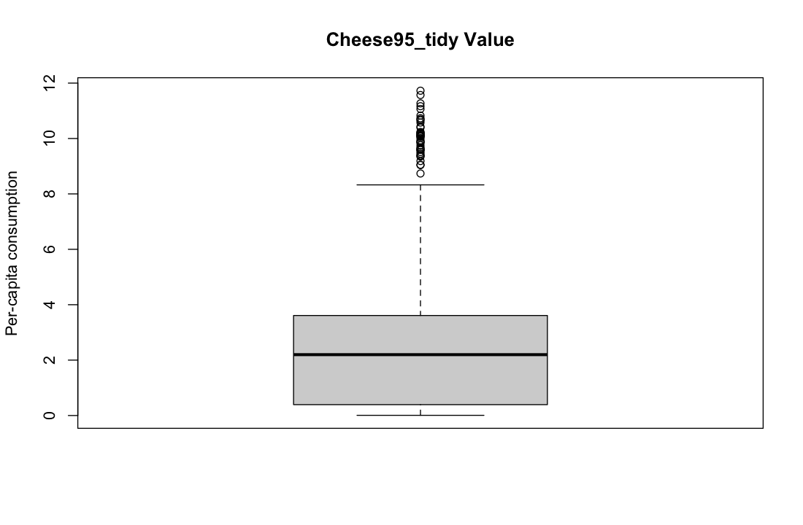
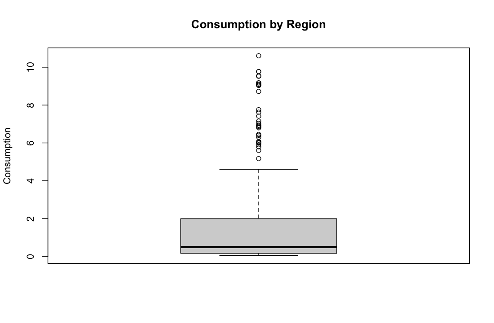

# Data Preparation for Business Analytics R

This folder organizes the R scripts, course handouts, exercises, reference files, datasets, and final project outputs for the **Data Preparation for Business Analytics** course in the NEOMABS2526 repository.

The original filenames are preserved. The organized folders below are added for GitHub browsing, while the original `Session 1` to `Session 10` folders are also kept as raw source folders.

## Repository Structure

```text
NEOMABS2526/
└── Data_Preparation_for_Business_Analytics_R/
    ├── README.md
    ├── scripts/
    │   ├── final_project/
    │   └── inclass_exercises/
    ├── reports/
    │   ├── inclass_exercises/
    │   └── reference/
    ├── figures/
    │   └── final_project/
    ├── data_sample/
    │   ├── final_project/
    │   └── inclass_exercises/
    ├── Session 1/ ... Session 10/
    └── Data/
```

| Folder | Content | Notes |
|---|---|---|
| `scripts/final_project/` | Final project R script and `group010.xlsx` | The Excel filename is kept beside the R script so `read_excel("group010.xlsx")` can run from that folder. |
| `scripts/inclass_exercises/` | Session 1-10 practice R scripts | Script filenames are unchanged and grouped by session. |
| `reports/inclass_exercises/` | Session handouts and exercise PDFs | Course PDFs are grouped by session without renaming. |
| `reports/reference/` | Mock exam, cheat sheets, and course intro PDF | Reference material for revision and upload context. |
| `figures/final_project/` | Generated final project figures | Figure order follows the `boxplot()` order in the final project R code. |
| `data_sample/` | Final project workbook and in-class datasets | `data_sample/inclass_exercises/` restores the practice datasets used by the scripts. |
| `Session 1/` to `Session 10/` | Raw original course folders | Preserved for traceability. |

## Final Project

**Files**

| Type | Path |
|---|---|
| Main R script | `scripts/final_project/Final Project_WenTing Xu-TingYi Kao-Chen He.R` |
| Source workbook | `scripts/final_project/group010.xlsx` |
| Data backup | `data_sample/final_project/group010.xlsx` |

**Workbook sheets**

| Sheet | Role in project |
|---|---|
| `Contents` | Workbook index and source context. |
| `Cheese per cap since '95` | Main post-1995 cheese consumption table; cleaned from mixed headers, repeated totals, type mismatches, and missing values. |
| `Cheese per cap '70-'94` | Historical cheese consumption table; split into regional and category-level tidy datasets. |

**Data preparation workflow**

| Step | R operations used | Cleaning decision |
|---|---|---|
| Import Excel ranges | `read_excel()`, `skip`, `sheet`, `range`, `col_names` | Skip non-data rows and manually define useful column names. |
| Reshape wide tables | `pivot_longer()` | Convert cheese types and years into tidy variables. |
| Fix duplicated totals | `rename()`, `filter()` | Rename repeated `Total` columns and remove redundant total variables. |
| Fix data types | `as.integer()`, `as.numeric()` | Convert year and consumption fields into analyzable numeric types. |
| Handle missing values | `is.na()`, `filter(!is.na())` | Remove structural blank rows and missing consumption entries. |
| Combine cleaned tables | `bind_rows()`, `arrange()` | Merge post-1995, regional, and category-level historical data. |
| Check outliers | `boxplot()`, `summary()` | Treat observed extreme values as consumption-pattern differences rather than automatic errors. |

### Final Project Figures

The following figures are arranged in the same order as the `boxplot()` calls in `Final Project_WenTing Xu-TingYi Kao-Chen He.R`.

| Order | Figure | Source code object | Interpretation |
|---|---|---|---|
| 1 | `01_Cheese95_tidy_Value_boxplot.png` | `boxplot(Cheese95_tidy$Value, ...)` | Distribution of cleaned post-1995 cheese consumption values after removing redundant totals and missing values. |
| 2 | `02_consumption_by_region_Consumption_boxplot.png` | `boxplot(consumption_by_region$Consumption)` | Distribution of historical regional cheese consumption values from American, Italian, and Miscellaneous cheese groups. |





## In-Class Exercises and Course Materials

| Session | Main topic | R script(s) | Course material |
|---|---|---|---|
| Session 1 | RStudio, working directory, variables, vectors, factors, matrices, data frames, lists | `KAO_Tingyi_Session1.R`, `KAO_Tingyi_Session1_inclass.R` | Handout and exercises in `reports/inclass_exercises/Session 1/` |
| Session 2 | Data import with `readr`, `readxl`, fixed-width files, web pages, and file type checks | `KAO_Tingyi_Session2.R` | Handout, exercises, and solution PDF in `reports/inclass_exercises/Session 2/` |
| Session 3 | Long and wide data, tidy data rules, `pivot_longer()`, `pivot_wider()` | `KAO_Tingyi_Session3.R` | Handout and exercises in `reports/inclass_exercises/Session 3/` |
| Session 4 | Column and row operations, `select()`, `filter()`, `bind_rows()`, `group_by()`, `summarise()`, `separate()`, `unite()` | `KAO_Tingyi_Session4.R` | Handout and exercises in `reports/inclass_exercises/Session 4/` |
| Session 5 | Missing values, duplicates, unit conversion, type conversion, simple imputation | `KAO_Tingyi_Session5.R` | Handout and exercises in `reports/inclass_exercises/Session 5/` |
| Session 6 | Outlier detection and correction with `boxplot()`, replacement, capping, and NA handling | `KAO_Tingyi_Session6.R` | Handout and exercises in `reports/inclass_exercises/Session 6/` |
| Session 7 | Date and time handling with `lubridate`, time zones, durations, periods, survey cleaning | `KAO_Tingyi_Session7.R` | Handout and exercises in `reports/inclass_exercises/Session 7/` |
| Session 8 | String manipulation with `stringr`, case normalization, substring extraction, matching, replacement, regular expressions | `KAO_Tingyi_Session8.R` | Handout and exercises in `reports/inclass_exercises/Session 8/` |
| Session 9 | Regex practice, `grepl()`, `gregexpr()`, `regexpr()`, DRG code cleaning, broken employee file parsing | `KAO_Tingyi_Session9.R` | Exercises in `reports/inclass_exercises/Session 9/` |
| Session 10 | Final project data cleaning and cheese consumption workbook preparation | Final project script in `scripts/final_project/` | Source workbook in `scripts/final_project/` and `data_sample/final_project/` |

## Reference Material

| File | Purpose |
|---|---|
| `reports/reference/Data Preparation for Business Analytics 01 upload.pdf` | Course introduction and R-oriented course context. |
| `reports/reference/Data Preparation Mock Exam 2026.pdf` | Mock exam practice. |
| `reports/reference/Mock_Exam_Questions_and_Solutions.pdf` | Mock exam questions and worked solutions. |
| `reports/reference/DataPrep_Exam_CheatSheet.pdf` | Revision cheat sheet. |
| `reports/reference/DataPrep_Exam_CheatSheetv2.pdf` | Updated revision cheat sheet. |

## How to Run the Final Project

1. Open R or RStudio.
2. Set the working directory to `scripts/final_project/`.
3. Install/load the required packages if needed: `readxl`, `dplyr`, `tidyr`, and `tidyverse`.
4. Run `Final Project_WenTing Xu-TingYi Kao-Chen He.R`.

The original script reads `group010.xlsx` by filename, so the workbook must stay in the same working directory when running the script without path edits.

## GitHub Upload Steps

Run the upload commands from the repository root. The commands below stage the organized GitHub-facing folders and avoid accidentally adding raw duplicate source folders or `.DS_Store` files:

```bash
cd /Users/kao900531/Documents/GitHub/NEOMABS2526
git status --short
git add Data_Preparation_for_Business_Analytics_R/.gitignore
git add Data_Preparation_for_Business_Analytics_R/README.md
git add Data_Preparation_for_Business_Analytics_R/scripts
git add Data_Preparation_for_Business_Analytics_R/reports
git add Data_Preparation_for_Business_Analytics_R/figures
git add Data_Preparation_for_Business_Analytics_R/data_sample/final_project
git add -u Data_Preparation_for_Business_Analytics_R/data_sample/inclass_exercises
git status --short
git commit -m "Add Data Preparation for Business Analytics R materials"
git push origin main
```

Before committing, review `git status --short` carefully. The current repository has shown an unrelated root `.DS_Store` modification before, and that file should not be staged unless intentionally needed. If you also want the raw `Session 1` to `Session 10` folders on GitHub, stage them separately after checking that the duplicate structure is acceptable.
