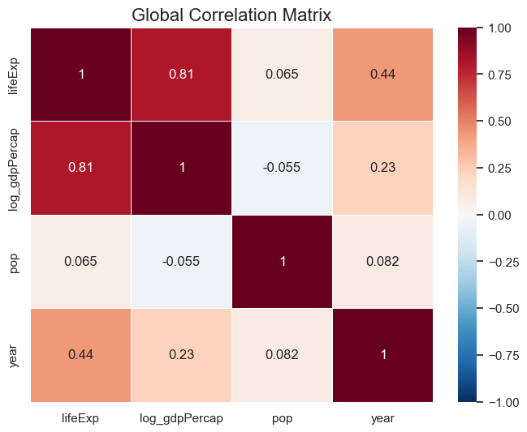
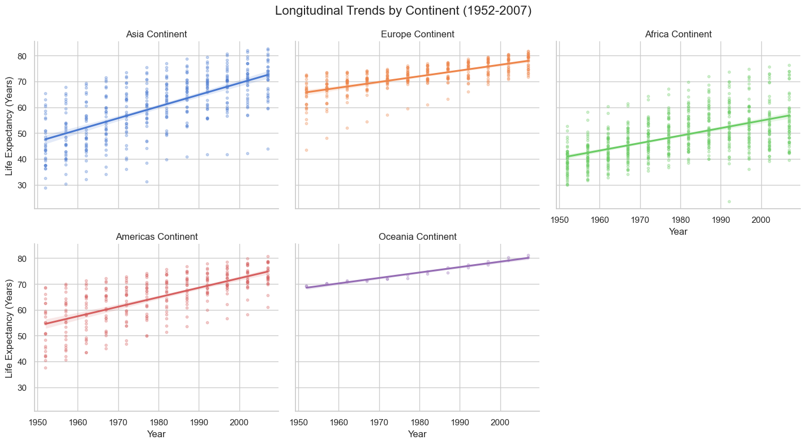
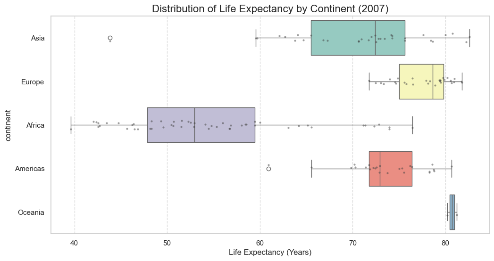

# Python Programming for Business Analytics

This folder contains the course notebooks, lecture materials, final project report, and project figures for the NEOMABS2526 course **Python Programming for Business Analytics**.

## Repository Structure

```text
Python_Programming_for_Business_Analytics/
|-- README.md
|-- scripts/
|   |-- inclass_exercises/
|   `-- final_project/
|-- reports/
|   |-- inclass_exercises/
|   `-- final_project/
`-- figures/
    `-- final_project/
```

## Course Materials

| Module | Topic | Notebook | Report / Slides |
| :--- | :--- | :--- | :--- |
| Module 1 | Python foundations: variables, data types, strings, dates, control flow, and basic coding practice | [Module1.ipynb](scripts/inclass_exercises/Module1.ipynb) | [Module1_Slides.html](reports/inclass_exercises/Module1_Slides.html), <a href="reports/inclass_exercises/Module 1_ Python Foundations.pdf">Module 1_ Python Foundations.pdf</a> |
| Module 2 | Data structures: lists, dictionaries, tuples, sets, loops, and applied exercises | [Module2.ipynb](scripts/inclass_exercises/Module2.ipynb) | [Module2_Slides.html](reports/inclass_exercises/Module2_Slides.html) |
| Module 3 | Pandas fundamentals: DataFrame creation, data loading, inspection, filtering, string operations, and dates | [Module3.ipynb](scripts/inclass_exercises/Module3.ipynb) | [Module3_Slides.html](reports/inclass_exercises/Module3_Slides.html) |
| Module 4 | Self-study practice: Python review, Pandas review, data cleaning, and Gapminder practice | [Module4.ipynb](scripts/inclass_exercises/Module4.ipynb) | [Module4_Slides.html](reports/inclass_exercises/Module4_Slides.html) |
| Module 5 | Visualization and capstone: Matplotlib, Seaborn, Plotly, and project preparation | [Module5.ipynb](scripts/inclass_exercises/Module5.ipynb) | [Module5_Slides.html](reports/inclass_exercises/Module5_Slides.html) |

## Final Project

**Project file:** [TingYi_KAO-FinalProject.ipynb](scripts/final_project/TingYi_KAO-FinalProject.ipynb)  
**Report PDF:** [TingYi_KAO-FinalProject.pdf](reports/final_project/TingYi_KAO-FinalProject.pdf)

The final project analyzes the relationship between economic output and public health outcomes using the Gapminder dataset. The analysis focuses on GDP per capita, life expectancy, population, year, and continent to answer three research questions:

| Research Question | Analytical Focus |
| :--- | :--- |
| RQ1: Wealth-health connection | Measures the relationship between `log_gdpPercap` and `lifeExp` using correlation and regression analysis. |
| RQ2: Temporal shifts | Tracks global changes in development patterns from 1952 to 2007. |
| RQ3: Regional catch-up | Compares life expectancy growth across continents and identifies regional divergence. |

### Dataset Overview

| Column | Type | Role in Analysis |
| :--- | :--- | :--- |
| `country` | Categorical | Country or territory identifier. |
| `continent` | Categorical | Regional grouping for comparison. |
| `year` | Numerical / time | Longitudinal time variable from 1952 to 2007. |
| `lifeExp` | Numerical | Main public health outcome. |
| `pop` | Numerical | Population size for weighting and bubble-size visualization. |
| `gdpPercap` | Numerical | Economic output per person. |
| `iso_alpha` | Categorical | Country code used for Plotly mapping. |
| `iso_num` | Numerical | Numeric ISO country code, identified as redundant for this analysis. |

### Key Findings

| Finding | Evidence from Project |
| :--- | :--- |
| Strong wealth-health relationship | The project reports a positive correlation of **r = 0.81** between `log_gdpPercap` and `lifeExp`. |
| Diminishing returns | Life expectancy gains slow after countries pass roughly **USD 5,000 GDP per capita**. |
| Regional catch-up | Asia shows the fastest improvement, with life expectancy growth above **60%** from 1952 to 2007. |
| Persistent inequality | Africa has the widest 2007 life expectancy spread and the lowest regional median. |
| Data limitation | The dataset ends in **2007**, so it does not include later shocks such as the 2008 financial crisis or COVID-19. |

## Figures

| Figure | Description | Static Image | Interactive Version |
| :--- | :--- | :--- | :--- |
| 01 | Skewness trends over time for GDP per capita and life expectancy | [PNG](figures/final_project/01_skewness_trends_over_time.png) | - |
| 02 | Global correlation matrix | [PNG](figures/final_project/02_global_correlation_matrix.png) | - |
| 03 | Log-GDP vs. life expectancy regression | [PNG](figures/final_project/03_log_gdp_life_expectancy_regression.png) | - |
| 04 | Longitudinal life expectancy trends by continent | [PNG](figures/final_project/04_longitudinal_trends_by_continent.png) | - |
| 05 | 2007 life expectancy distribution by continent | [PNG](figures/final_project/05_life_expectancy_distribution_2007.png) | - |
| 06 | Evolution of global development from 1952 to 2007 | - | <a href="figures/final_project/Evolution of Global Development (1952-2007)_plot.html">HTML</a> |
| 07 | Total percentage growth in life expectancy from 1952 to 2007 | - | <a href="figures/final_project/Total Percentage Growth in Life Expectancy (1952-2007)_plot.html">HTML</a> |

### Selected Visualizations







## Notes for Use

- Open notebooks in Jupyter Notebook, JupyterLab, VS Code, or Google Colab.
- Open `.html` files locally in a browser to view interactive Plotly charts.
- The final project notebook uses the public Plotly Gapminder CSV source from GitHub.
- Local system files such as `.DS_Store` are excluded by the parent repository `.gitignore` and are not part of the course package.
